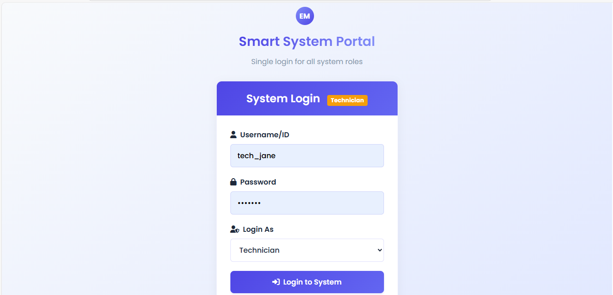
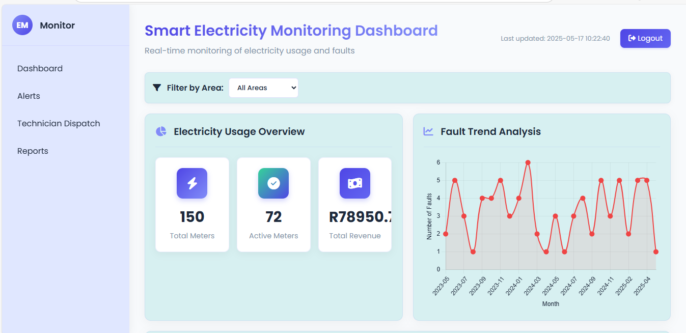
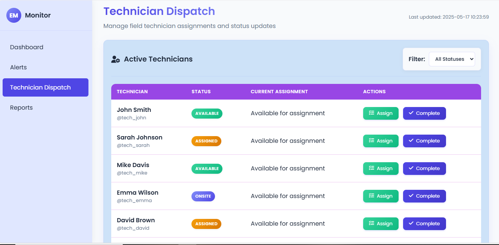
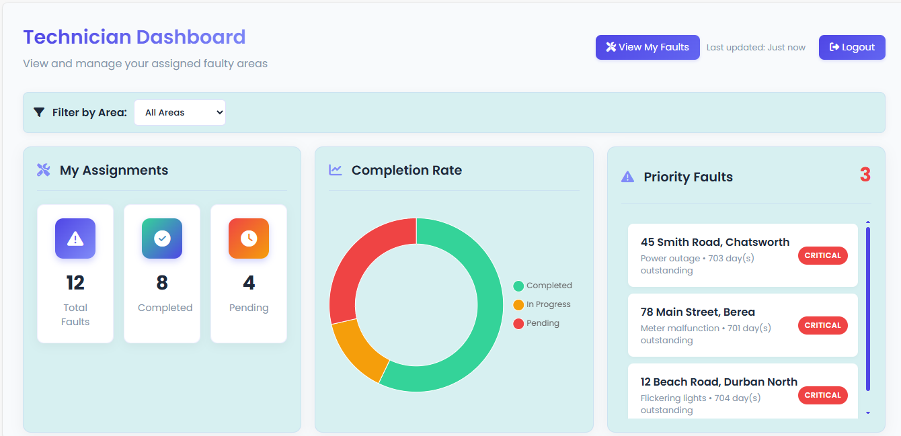

# Eskom Smart System ⚡





A comprehensive web-based platform for monitoring electricity usage, managing faults, dispatching technicians, and generating reports for efficient power grid management.

## 🌟 Table of Contents
- [Project Overview](#-project-overview)
- [Key Features](#-key-features)
- [Technology Stack](#-technology-stack)
- [File Structure](#-file-structure)
- [License](#-license)

## 🚀 Project Overview
The **Eskom Smart System** is an intelligent power management solution designed to:

🔹 Monitor real-time electricity consumption  
🔹 Streamline fault reporting and resolution  
🔹 Optimize technician dispatch operations  
🔹 Generate actionable insights through analytics  
🔹 Improve overall grid reliability and service quality

The system serves as a centralized platform for both administrators and field technicians, featuring role-based access control and intuitive dashboards.

## ✨ Key Features

### 👨‍💻 User Management
- **Role-based Access Control** 🔐
  - Administrators: Full system access
  - Technicians: Task-specific privileges
- **Secure Authentication** 🔒
  - Encrypted credential storage
  - Session management

### 📊 Monitoring Dashboard
- **Real-time Metrics** 📈
  - Current power usage
  - Revenue generation
  - Active meter status
- **Geospatial Visualization** 🌍
  - Interactive Leaflet.js map
  - Fault location plotting
- **Fault Management** ⚠️
  - Detailed fault listings
  - Status tracking (Reported/Resolved)
  - Area-based filtering

### 🔔 Alert Management
- **Centralized Alert Console** 🚨
  - Device ID tracking
  - Location-based alerts
  - Timestamped issues
- **Smart Filtering** 🔍
  - By location
  - By issue type
  - By status

### 👨‍🔧 Technician Operations
- **Resource Management** 🛠️
  - Technician status tracking (Available/Assigned/On-site)
  - Workload balancing
- **Field Dispatch** 📱
  - Fault assignment
  - Priority management
  - Location mapping

### 📑 Reporting Engine
- **Custom Report Generation** 📊
  - Multiple output formats
  - Date range selection
  - Area-specific filters
- **Data Export** 💾
  - CSV, Excel, PDF outputs
  - Scheduled reports

### 🤖 Predictive Analytics
- **Outage Prediction** 🔮
  - Machine learning model
  - Historical data analysis
  - Risk forecasting

## 💻 Technology Stack

### Backend
| Component       | Technology           | Description                          |
|----------------|---------------------|--------------------------------------|
| Framework      |  Flask | Lightweight WSGI web application framework |
| API            | RESTful             | Standardized communication protocol  |
| Authentication | Session-based       | Secure user validation               |

### Frontend
| Component       | Technology           | Description                          |
|----------------|---------------------|--------------------------------------|
| Markup         |  | Structure and content                |
| Styling        |  | Presentation and layout              |
| Interactivity  |  | Dynamic functionality               |
| Mapping        |  | Interactive geospatial visualization |

### Data Management
| Component       | Technology           | Description                          |
|----------------|---------------------|--------------------------------------|
| Data Storage   | CSV/XLSX            | Electricity usage datasets           |
| Cache          | JSON                | Geolocation data caching             |
| Model          | Joblib              | Serialized ML model                  |


## 📁 File Structure
```
Eskom-smart-system/
├── .env                          # Environment configuration
├── app.py                        # Flask application core
├── data/                         # System datasets
│   ├── durban_electricity_data.csv
│   ├── electricity-use-ethekwini-with-revenue.xlsx
│   └── geolocation_cache.json
├── models/                       # Machine learning assets
│   └── power_outage_model.joblib
├── requirements.txt              # Python dependencies
├── static/                       # Frontend assets
│   ├── css/
│   ├── js/
│   └── images/
│       └── eskom_logo2.jpg
└── templates/                    # UI components
    ├── alerts.html
    ├── dashboard.html
    ├── index.html
    ├── reports.html
    ├── technicians.html
    └── technician_dashboard.html
```
## Setup Instructions
1. Clone the repository:

```bash
git clone https://github.com/calvinkhoza/Eskom-smart-system.git
cd Eskom-smart-system
```

2. Create and activate virtual environment:
```
python -m venv venv
source venv/bin/activate  # Linux/Mac
venv\Scripts\activate     # Windows
```

3. Install dependencies:

```bash
pip install -r requirements.txt
```
4. Run the application:

```bash
flask run
```

## 📄 License
This project is licensed under the MIT License - see the LICENSE file for details.


